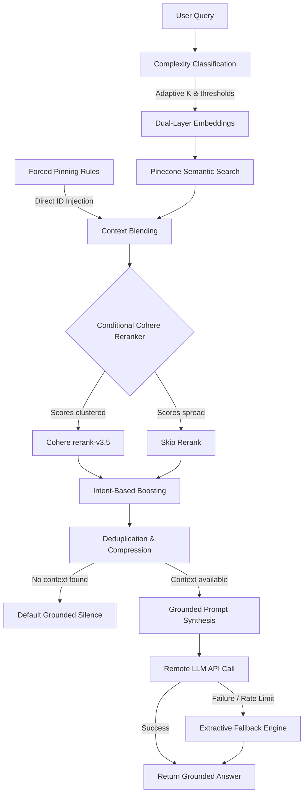

# 🧠 RAG System Optimization: Implementation & Architectural Guide

This guide consolidates the design decisions, core pipeline architecture, optimization strategies, and evaluation framework definitions for the **Smart Parking Booking System - RAG Backend**.

---

## 📋 Table of Contents
1. [Core RAG Architecture](#1-core-rag-architecture)
2. [RAG Pipeline Flowchart](#2-rag-pipeline-flowchart)
3. [RAG Pipeline Steps (Specifics)](#3-rag-pipeline-steps-specifics)
4. [Optimization Highlights (Problems Solved)](#4-optimization-highlights-problems-solved)
5. [Evaluation Framework Architecture](#5-evaluation-framework-architecture)

---

## 1. Core RAG Architecture

The RAG backend is built as a highly performant, asynchronous system designed to run locally or in resource-constrained environments (like Render).

*   **FastAPI Backend (`ask.py`)**: Handles async requests, CORS, complexity classification, and diagnostic health routing.
*   **Pinecone Cloud Vector DB**: Stores document embeddings. Queries are executed dynamically based on vector distances.
*   **Dual-Layer Embeddings**: Dynamically loads a local `all-MiniLM-L6-v2` transformer model. If unavailable (e.g., during deployment on Render's free tier), it automatically falls back to embedding generation via the **Hugging Face Inference API** to ensure 100% service uptime.
*   **Remote LLM Generation**: Uses OpenRouter (Llama 3.3 70B, Gemini) or Grok (xAI) APIs at low temperature (`0.1`) to ensure highly deterministic and grounded responses.

---

## 2. RAG Pipeline Flowchart

The following flowchart details how a query moves through parameter adaptation, direct fetch, conditional reranking, intent boosting, and prompt synthesis:

---

## 3. RAG Pipeline Steps (Specifics)

Here is a step-by-step breakdown of each stage in the RAG execution pipeline:

### Step 1: Complexity Classification
*   **Inputs**: Raw User Query String.
*   **Why**: Simple queries only need minimal context for speed and lower token cost, while complex policy or multi-intent queries need deeper retrieval depths and lower filtering thresholds.
*   **What it does**: Evaluates keyword density (commas, question marks, length, specific intent indicators) to classify the query as `SIMPLE`, `MEDIUM`, or `COMPLEX`.
*   **Outputs**: Dictionary of custom hyperparameters (`adaptive_k`, `context_limit`, `similarity_threshold`, `dedup_ratio`).

### Step 2: Query Embedding
*   **Inputs**: User Query String.
*   **Why**: Translates text into a mathematical coordinate space to enable vector cosine similarity searches.
*   **What it does**: Attempts to generate the embedding using local `all-MiniLM-L6-v2` packages. If they are missing (e.g. on serverless environments), it automatically dispatches an asynchronous call to the Hugging Face Inference API.
*   **Outputs**: 384-dimensional floating-point vector.

### Step 3: Pinecone Semantic Search
*   **Inputs**: Query vector, `adaptive_k` retrieval depth parameter.
*   **Why**: Swiftly retrieves candidate document segments that share semantic overlap with the user's query intent.
*   **What it does**: Performs a Cosine Similarity vector search on the Pinecone index.
*   **Outputs**: List of Pinecone Match objects containing vector IDs, raw scores, and chunk text metadata.

### Step 4: Direct Fetch (Pinning Rules)
*   **Inputs**: User Query String, retrieved matches list.
*   **Why**: Classic vector similarity search can miss critical workflow steps (e.g. Razorpay wallet flow or exact cancel windows) if the user's natural language phrasing shares zero common vocabulary with dense policy documentation.
*   **What it does**: Evaluates keyword rules (`PINNED_SECTION_RULES`). If a rule matches (e.g., cancellation policy), it fetches hardcoded document vector IDs directly from Pinecone and prepends them to the matches.
*   **Outputs**: Combined matches list.

### Step 5: Conditional Cohere Reranker
*   **Inputs**: Combined matches, User Query String.
*   **Why**: Vector database searches only measure distance. Reranking evaluates query-to-chunk correlation deeply. However, running it on every request adds 100-300ms latency.
*   **What it does**: Inspects the score spread of the top 3 matches. If the scores are clustered together (spread $< 0.12$), it dispatches matches to the Cohere rerank-v3.5 API and updates `m.score` with the relevance score. Otherwise, skips reranking to save latency.
*   **Outputs**: Top 20 matches sorted by semantic relevance.

### Step 6: Intent-Based Boosting
*   **Inputs**: Sorted matches, User Query String.
*   **Why**: Certain queries indicate strong interest in workflows or policy compliance, meaning chunks containing structural markers (like step lists or section numbers) must be prioritized.
*   **What it does**: Identifies query intent, multiplies matching chunk scores by `1.15` (for workflows) or `1.10` (for policies), and resorts the list by the updated scores.
*   **Outputs**: Boosted and re-sorted matches list.

### Step 7: Deduplication & Compression
*   **Inputs**: Matches list.
*   **Why**: Overlapping document segments cause redundant contexts in the prompt, bloating generation costs and confusing the LLM.
*   **What it does**: Filters out chunks below the complexity-defined `similarity_threshold`. Deduplicates matches using text sequence matching (`SequenceMatcher` threshold $= 0.82$).
*   **Outputs**: Deduplicated list of high-signal context strings.

### Step 8: Prompt Synthesis & LLM Generation
*   **Inputs**: Final context strings, User Query String.
*   **Why**: Translates retrieved factual contexts into a coherent, natural answer matching the exact user intent.
*   **What it does**: Injects retrieved context into a strict prompt template (forbidding external knowledge). Calls the configured LLM API (OpenRouter/Grok) at temperature `0.1`.
*   **Outputs**: Grounded response string. If the LLM call fails or is rate-limited, it automatically invokes the **Extractive Fallback Engine** to summarize context lines directly.

---

## 4. Optimization Highlights (Problems Solved)

### ⚡ Problem 1: Retrieval Overhead vs. Insufficient Context
*   **The Issue**: Simple queries suffered from unnecessary retrieval latency and noise, while complex queries failed because the retrieved context was too shallow to answer multi-intent policy questions.
*   **The Solution: Adaptive K & Retrieval Ceilings**:
    We implemented a query complexity analyzer. Simple questions retrieve fewer chunks ($K=25$, limit 6, threshold 0.35) for fast response times. Complex queries scan deeper ($K=25$, limit 10, threshold 0.25) to provide the LLM with a comprehensive dataset.

### 🗑️ Problem 2: Token Bloat & Conflicting Duplicate Contexts
*   **The Issue**: Overlapping documentation sections created redundant chunks, causing high token costs, hitting LLM context ceilings, and degrading generation quality (due to conflicting duplicate text).
*   **The Solution: Context Deduplication & Compression**:
    We integrated a text sequence matcher (`SequenceMatcher` threshold = 0.82) to strip duplicate semantic blocks. A compression algorithm is applied to extract only highest-signal sentences, maximizing token efficiency.

### 🎯 Problem 3: Semantic Gaps in Critical Workflow Actions
*   **The Issue**: Semantic vector search frequently missed crucial procedure segments (such as cancellation policies or double payment handling) because the user's natural language queries shared zero token overlap with dense legal/system text.
*   **The Solution: Forced Vector Pinning**:
    We created a rule-based pinning engine (`PINNED_SECTION_RULES`). When specific intents (e.g., booking creation) are detected, the system bypasses semantic distance calculations and directly fetches targeted vector IDs to force-inject the correct policies into the LLM's prompt.

---

## 5. Evaluation Framework Architecture

To keep scoring completely objective, the codebase features two independent evaluation workflows:

### 🏆 A. Quality Scoring (LLM-Judge / Ragas-Style)
Executed via `eval_ragas.py`, this pipeline uses advanced LLMs to evaluate semantic accuracy and grounding across five metrics:

1.  **Faithfulness (NLI-based)**: Classifies generated claims against the retrieved context as *Entailed*, *Contradicted*, or *Not In Context* to identify hallucinations.
2.  **Answer Relevancy**: Assesses how directly and completely the answer addresses the user query.
3.  **Context Recall**: Determines what ratio of the reference ground truth is present in the retrieved context blocks.
4.  **Context Precision**: Evaluates the signal-to-noise ratio in retrieved context blocks.
5.  **Weighted Overall Score**:
    $$\text{Overall Score} = 0.30 \times \text{Faithfulness} + 0.25 \times \text{GT Alignment} + 0.20 \times \text{Answer Relevancy} + 0.15 \times \text{Context Recall} + 0.10 \times \text{Context Precision}$$
6.  **Smart Negative Override**: If a question cannot be answered from the docs, and the generator correctly says "information not found" (with the ground truth confirming this), the evaluator overrides the score to a perfect **`1.0`** so correct silence is not penalized.

### 📊 B. Statistical Validation (No LLM)
Executed via `eval_stats.py`, this provides a fully reproducible baseline without LLM generator bias:

*   **ROUGE-L**: Measures lexical overlap (longest common subsequence) between the generated answer and ground truth.
*   **BERTScore F1**: Measures semantic token-level similarity using contextual embeddings (`distilbert-base-uncased`).
*   **SBERT Cosine Similarity**: Employs sentence embeddings (`all-MiniLM-L6-v2`) to compute cosine similarity for two vectors:
    *   *Answer vs. Ground Truth* (factual alignment)
    *   *Answer vs. Context* (degree of grounding)
